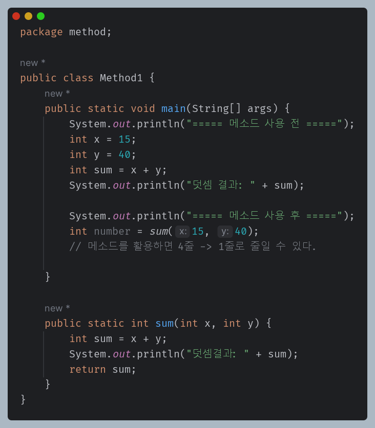

# 메서드(Method) 

#### ✔ 함수(function)
- 수학에서 가져온 개념: 값을 입력하면, 연산을 처리하여 결과를 출력한다.
- 메서드(Method) = 자바에서의 함수(function)

## 메서드(Method)

### 메서드 정의
- 제어자(Modifier) : public, static
- 리턴타입(Return Type) : 메서드가 실행된 뒤 반환되는 타입
- 메서드 이름(Method Name) : 메서드를 호출하는데 사용된다.  
  🔸 따라서 가능하면 기능이 드러나도록 이름을 짓는 것이 좋다. 
- 매개변수(Parameter) : 입력 값, 메서드 내부에서 사용 가능한 변수, 매개변수가 없을 수도 있음
- 메서드 본문(Method Body) : 실행되는 코드 블록, { } 사이에 위치
> [리턴타입][메소드 이름] ([매개변수..]) {  
> // 실행할 코드  
> }

ex)

#### ✔ 메서드 선언
- 매개변수(x,y)와 리턴(출력값)을 가짐
  - 리턴: void ➡ 출력값이 없어도 되는 메서드(return 생략 가능)
  - 메서드 내에 조건문이 있는 <u>경우 모든 경우에 대해 리턴값이 존재해야 함.</u>   
    📌 조건문을 만족하지 않을 때도 return값 필요
  - 메서드의 경우 return을 만나면 그 즉시 메서드 종료  
    ➡ return 이후 다른 값을 넣으면 에러 발생

### 메서드의 장점
- 반복되는 코드의 중복을 줄일 수 있다. 
- 작업이 분리되어 코드의 가독성이 향상된다. 
- 코드를 다른 프로그램에서 재사용할 수 있다. 
- 기존의 기능을 확장해서 사용하는데 유용하다.
- 메서드 사용할 때 내부 작업, 구현부에 대해 알 필요가 없이 사용할 수 있다. 
- 모듈화된 메서드는 개별적으로 테스트하고 디버깅할 수 있다. 
- 유지보수가 용이해진다. 

### 메서드 명명 규칙
- 기본적으로 변수의 이름을 붙이는 방식과 동일 (ex. CamelCase)
- 메서드의 이름에는 동사를 사용해서 시작하는 것이 좋다
  - ex) addNumber: 두숫자를 더하는 메서드 ⬅ **명시적으로 추측 가능하도록**
  - ex) setEmployeeName: 직원의 이름을 설정하는 메서드
- 일반적으로 널리 사용되지 않는 약어를 사용하지 않는 것이 좋다.
  - addN, getSi, SetEn ⬅ 무슨 기능을 하는지 추측하기 어려움

## 메서드 오버로딩(Overloading)

- 같은 이름의 메서드를 여러개 정의하는 것
- 메서드의 이름은 같지만, 매개변수의 개수가 다르거나, 타입이 다르면 오버로딩 가능
- 메서드의 이름이 같아도, 타입의 순서가 다르면 오버로딩 가능
- <u> 리턴 타입만 다를 경우에는 오버로딩 불가능</u>
- 오버로딩된 메서드는 모두 **같은 클래스**에 정의되어야 한다. 
ex)

#### ✔ 메서드 제대로 이해하기(행맨 게임 만들기)✨

- method.ex.Ex7_hangMan

