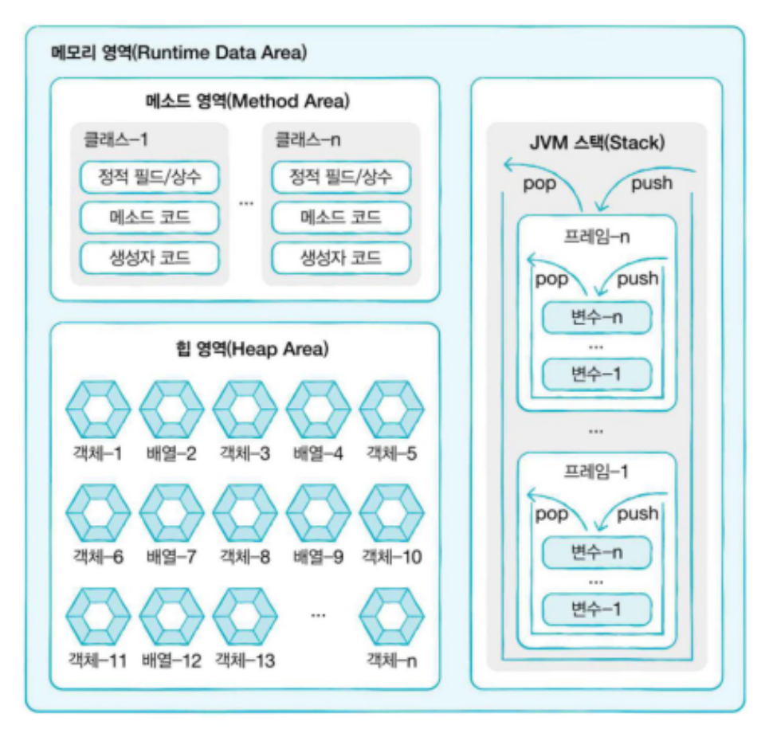

# 참조(reference)

## 메모리 사용 영역
1. 메소드 영역(Method Area)
   - 클래스 별로 저장됨
   - 프로그램을 실행하는데 필요한 공통 데이터를 공유하는 영역
   - 모든 스레드에 공유되고, 한 번 불러 온 클래스 정보는 메서드 영역에 저장
   - 클래스의 정보, 메서드의 실행 코드, static 영역, 상수 등을 보관
     - 정적필드
     - 상수
     - 생성자
     - 메소드
   - 코드 등을 분류해 저장
2. 힙 영역(Heap Area)
   - 모든 객체와 배열이 생성되고 동적으로 할당되는 영역
   - 모든 스레드에서 공유된다. 
   - 더이상 참조가 되지 않은 객치 GC(Garbage Collector)에 의해 제거된다.
3. JVM 스택영역
   - 자바를 실행하면, 각 스레드에 의해 실행 스택이 생성되고,
   - 메서드가 호출될 때마다 메서드를 위한 스택 프레임이 생성된다.
   - 스택 프레임에서는 변수 등이 선언되고 메서드 종료시 제거

## Stack 자료구조와 Queue 자료 구조
1. Stack 자료구조
   - 후입선출(LIFO:Last In First Out) 방식으로 작동
   - 마지막에 들어간 데이터가 먼저 나온다
   - 활용
     - 웹브라우저의 뒤로가기 / 앞으로 가기
     - 실행취소(Ctrl + z) : 실행취소
     - 자바의 스택영역
   - 일반적으로 데이터 입력을 push, 출력은 pop라고 한다.
   - 데이터 삽입 예시
     - 1 (push) -> 2 (push) -> 3(push) -> 3 (pop) -> 2 (pop) -> 1 (pop)
2. Queue 자료구조
   - 선입선출(FIFO: First In First Out) 방식으로 작동
   - 먼저 들어온 데이터가 먼저 나온다. 
   - 활용
     - 프린터 출력 대기 큐
   - 데이터 삽입 예시
     - 1(push) -> 2(push) -> 3 (push) -> 1(pop) -> 2(pop) -> 3(pop)

### 기본타입(primitive type)
- 정수, 실수, 문자, 논리 리터럴 저장
- 기본 타입은 시작하는 문자가 소문자이다. 
- 변수 선언과 초기화와 동시에 스택영역에 저장 (생성X)

### 참조 타입(reference type)
- `객체(object)`의 번지를 참조하는 타입  
> 📌 객체: 변수, 데이터 구조, 함수, 메서드가 될 수 있으며 식별자가 참조하는 메모리값
- 참조 타입은 시작하는 문자가 대문자이다. 
- 참조 타입은 변수 선언 및 초기화를 하면 참조값이 `힙 영역`에 저장
- 스택 영역에는 `변수의 번지 값만 저장`되어 있음

#### 참조 타입간 비교(변수간 ==, != 연산)
- 동일 객체를 참조하는지, 다른 객체를 참조하는지 알아볼 때 사용
- 참조 타입의 경우 동일한 객체를 참조하는지 아닌지를 비교 ➡ `참조값` 비교  
📌 따라서 참조 타입 간 비교, 특히 문자를 비교할 때 **equals()** 를 사용하는 것이 더 적합
  ➡ equals() 는 참조값을 비교하는 것이 아니라 **내부값**을 비교

#### 참조타입 간 연산
- 참조타입은 기본적으로 연산이 불가능
- 하지만 참조 타입의 '기본 타입 필드'에 접근하면 연산 가능 
> ex)  
> Data data1 = new Data();   
> Data data2 = new Data();  
> 
> data1.value1 = 10;  
> Data data2 = data1;  
> 
> int dataSum = data1 + data2;  
> ➡ <u> 연산 불가‼ </u>
> 
> int dataSum = data1.value1 + data1.value2;  
> ➡ 참조 타입의 `기본 타입 필드`에 접근 시 연산 가능

## Null

- null : 참조 타입의 변수가 객체를 참조하지 않는다는 것을 나타내는 것 
   ▶ <u> 값이 비어있다</u>  ➡ 0과는 다른 개념
- null값을 가진 참초타입 변수 
  - 변수가 초기화되지 않았을 때
  - 객체가 명시적으로 null 값으로 설정되었을 때 `String str = null`
  - 객체가 메모리에서 삭제되었을 때
- 참조 타입 변수가 null 값을 가지고 있는데, 메서드나 필드에 접근 ➡ `NullPointerException (NPE)`
  - NPE는 컴파일 단계에서는 확인 불가 ▶ 실행 후 에러 발생
  - NPE 발생시 해당 참조 변수가 객체를 참조하도록 수정하여 해결

## New 연산자
- 객체 생성 연산자
- 힙 영역에 새로운 객체 생성