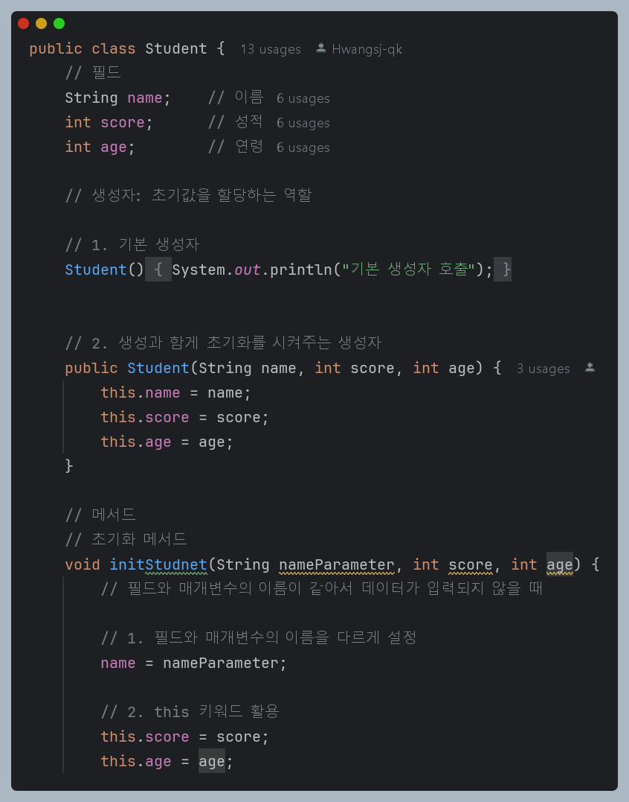

# 클래스(Class)

### ⭐ 객체지향 프로그래밍 ⭐

- 절차적 프로그래밍(Procedural Programming)
    - 프로그램을 일련의 순서, 절차나, 함수의 집합으로 보는 방식
    - 상단에서부터 하답으로 프로그램 코드를 순서대로 실행
    - 함수(Function) / 절차(Procedure)를 정의하고 호출
- 객체지향 프로그래밍(OOP: Object-Oriented Programming)
    - 프로그램을 객체(Object)의 집합으로 보는 방식
    - 객체는 데이터(속성, 필드)과 데이터를 조작하는 기능(함수, 메서드)으로 캡슐화됨
    - 주요 4대 특징
        - 캡슐화: 데이터와 기능을 캡슐처럼 함께 포장
        - 상속: 한 클래스가 다른 클래스의 특성을 상속받음
        - 다형성: 객체 타입에 따라 다른 방식으로 작동
        - 추상화: 복잡한 실제 세계를 단순한 모델로 표현
    - 모든 사물과 개념을 속성과 기능을 가지고 있는 객체로 단순화, 추상화시키는 것
    - 추상화 -> 모델링: 데이터 + 행동
    - 객체지향프로그래밍 방법이 가장 널리 활용됨

## 클래스(Class)

- 객체를 생성하기 위한 설계도 혹은 틀, 템플릿
- 클래스의 구조
  - 필드(Field) : 객체의 데이터
  - 생성자(Constructor) : 객체를 생성할 때 초기화를 담당
  - 메소드(Method) : 객체를 수행하는 행동

### ✔ 객체(Object)
- 클래스에서 정의된대로 메모리에 할당된 <u>인스턴스</u>
  - *️⃣ 인스턴스(instance: 사례)
- `new` 키워드를 통해서 객체 생성
- 객체(Object)와 인스턴스(instance)의 차이
  - 객체는 모든 인스턴스를 포괄하는 넓은 의미라고 할 수 있음 
- 객체 : 클래스에서 나온 실체 ➡ 인스턴스는 클래스의 관계에 맞춰져 있음
  >   ex)
  >   - Student는 클래스다 `Student student1 = new Student()`
  >   - student1은 Student의 인스턴스이다.
  >   - student1은 객체다.

### ✔ 생성자

- 특징
  - 클래스와 이름이 동일하다
  - 리턴 타입이 없다 (void도 사용하지 않음)
  - 오버로딩이 가능하다 (매개변수의 타입이나 개수에 따라 여러 개 정의가 가능하다)
- 종류
  - 기본 생성자 : 사용자가 정의하지 않으면 컴파일러에서 자동 생성 (매개변수 x)
  - 사용자 정의 생성자 : 매개변수를 가지고, 객체 생성시 초기값을 전달한다.
- `this` 키워드
  - 객체가 자기 자신을 가리키는데 사용되는 키워드
  - 생성자에서 매개변수와 클래스의 필드 이름이 중복되는 경우가 있을 때 <u>**this**</u> 키워드를 통해 구분
    - `this.name = name`
  - this() : 다른 생성자를 호출할 때
    - 생성자 오버로딩이 있을 때 코드의 중복을 줄일 수 있음
    -

